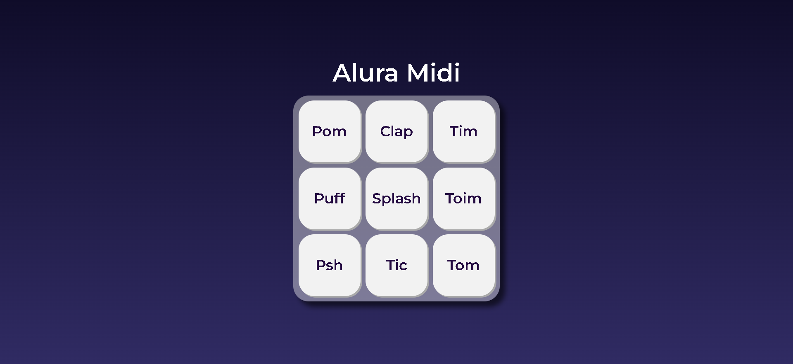
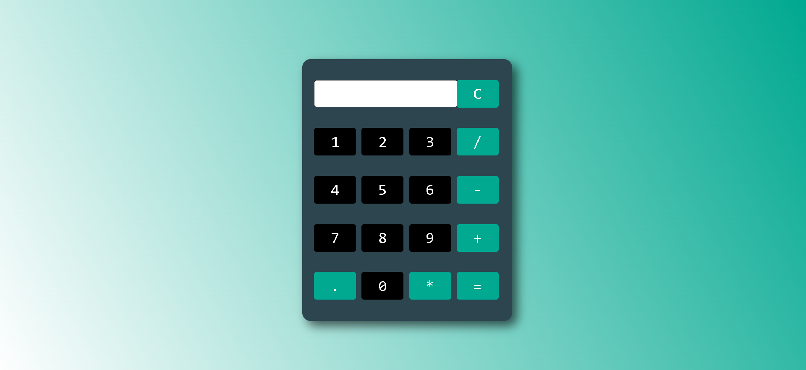
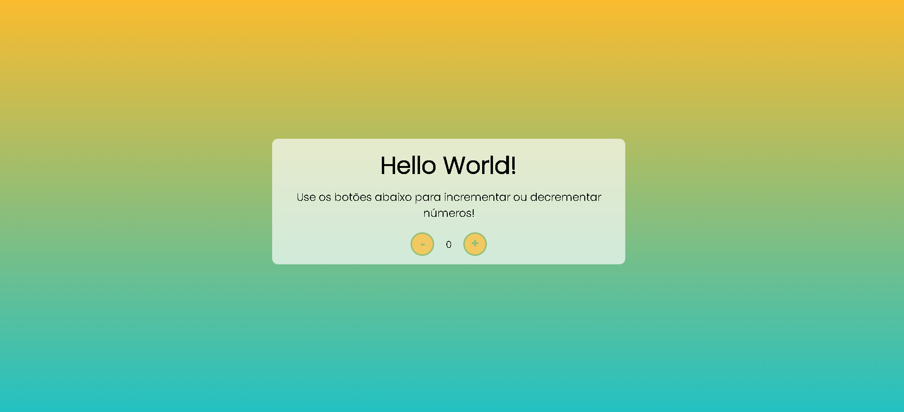

# Projetos Simples | JavaScript.</h1>

 Esse repositório foi criado com a intenção de depositar meus primeiros projetos realizados com JavaScript. Você pode acessá-los com seus respectivos projetos abaixo - do mais recente pro mais antigo. 

<h2 align="center">Alura MIDI</h2>

 
 
 
 
 

• Projeto criado no curso JavaScript para Web: Crie Páginas Dinâmicas proporcionado pela Alura.
 
• Criado em 22/09/2022
 
• Para acessá-lo, <a href="https://amandavsadev.github.io/projetosSimples-JS/aluraMidi">clique aqui</a>! 

  

<h2 align="center">Calculadora Básica</h2>

 
 
 
 
 

 

• Calculadora que opera as funções básica (adição, subtração, multiplicação e divisão).
 
• Criado em 17/06/2022
 
• Para acessá-lo, <a href="https://amandavsadev.github.io/projetosSimples-JS/calculadoraBasica">clique aqui</a>! 

  

<h2 align="center">Contador</h2>

 
 
 
 
 

 

• Minha primeira página utilizando JavaScript. O contador foi desenvolvido nas aulas do curso de JavaScript através do bootcamp Decola Tech 3a edição na plataforma Digital Innovation One junto com Avanade. 
 
• Criado em 02/06/2022
 
• Para acessá-lo, <a href="https://amandavsadev.github.io/projetosSimples-JS/contador">clique aqui</a>! 

